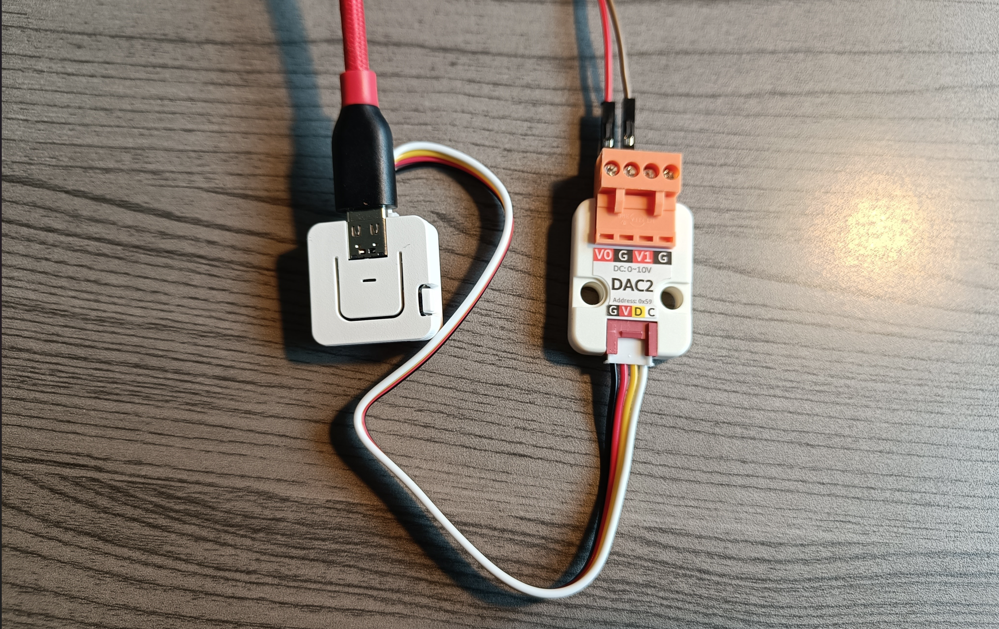

# Kalfire component

ESPHome component for Kalfire fireplace using 0-10V inteface

## Features

* Enable flame: Power on or off the Kalfire fireplace
* ECO mode: Toggle ECO mode on or off
* Flame Height: Set a desired flame height using one of the 8 settings

The component will calculate a voltage for an 0-10V output depending on the settings.



The implementation is tested with an [M5Stack Atom S3](https://docs.m5stack.com/en/core/AtomS3) and [GP8403 DAC2](https://docs.m5stack.com/en/unit/Unit-DAC2) module.

## Example

The component lets you choose any output component that supports float values.
You need to provide one. In the example below `my_gp8403_output_1` is an ESPHome output component id.

```yaml
external_components:
  source: github://sillevl/esphome-components
  components: [ kalfire ]

switch:
  - platform: kalfire
    flame:
      name: Enable flame
    eco_mode:
      name: Enable ECO mode

number:
  - platform: kalfire
    flame_height:
      name: Flame height

kalfire:
  id: my_kalfire
  output: my_gp8403_output_1
```

An example configuration can be found in the [kalfire_example.yaml](../../kalfire_example.yaml) file.
